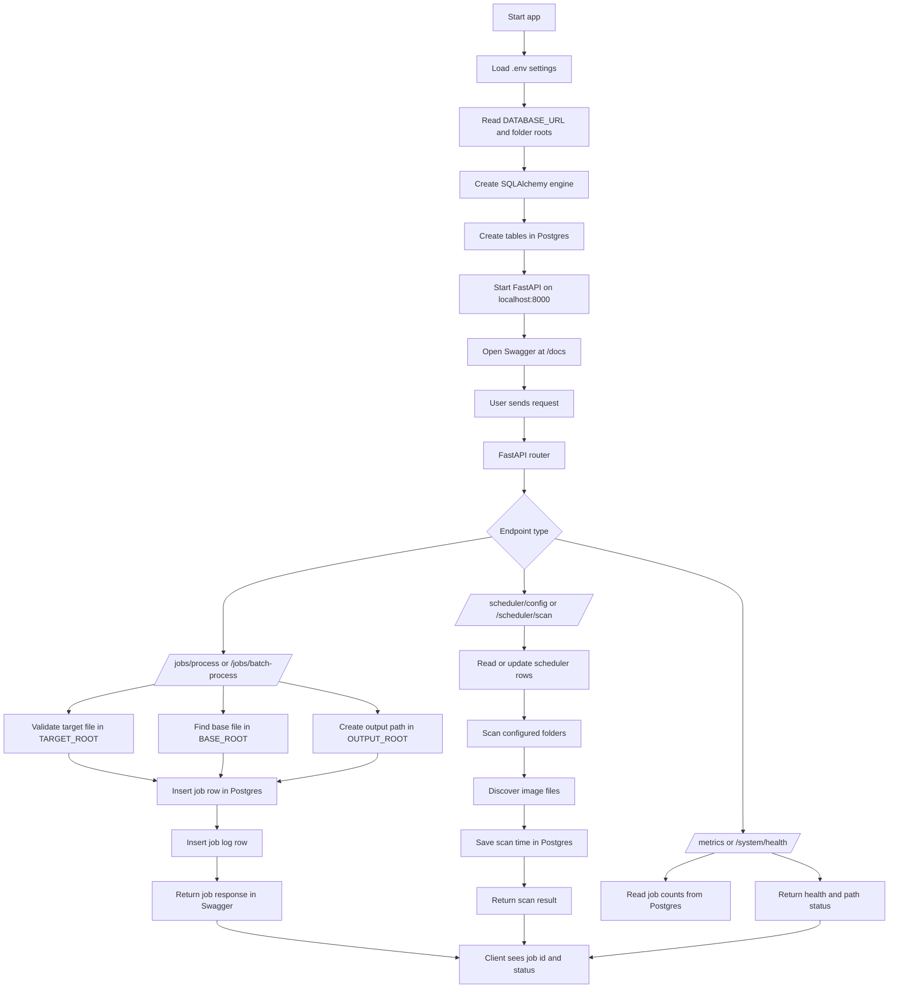
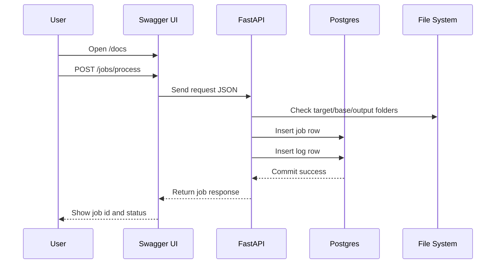

# Coregistration Backend Flow

This is the end-to-end flow of the current FastAPI backend.

## What Happens From Start to End

1. You set `DATABASE_URL`, `TARGET_ROOT`, `BASE_ROOT`, and `OUTPUT_ROOT` in `api/.env`.
2. `python -m api.init_db` connects to Postgres and creates the tables.
3. `uvicorn api.main:app` starts the API.
4. Swagger opens at `/docs`.
5. When you call `/jobs/process`, the API:
   - checks the target file in `TARGET_ROOT`
   - finds the base file in `BASE_ROOT`
   - prepares the output path in `OUTPUT_ROOT`
   - stores the job in Postgres
   - stores an initial log row
6. When you call `/scheduler/scan`, the API:
   - reads configured watch folders from Postgres
   - scans them for image files
   - updates scan timestamps
7. When you call `/metrics` or `/system/health`, the API reads live data from Postgres and the local folders.

## Simple Request Flow

## Folder Role

- `TARGET_ROOT`: where incoming target images live
- `BASE_ROOT`: where reference/base images live
- `OUTPUT_ROOT`: where generated output files are written
- `STAGING_ROOT`: optional temporary working area
- `LOG_ROOT`: optional logs folder

## Database Role

- `jobs` stores each processing request
- `job_logs` stores step-by-step logs for each job
- `scheduler_config` stores watched folders and scan rules

## End Result

You get a real backend flow:

- Swagger-based testing
- Postgres persistence
- real folder validation
- real output path creation
- no in-memory simulation
